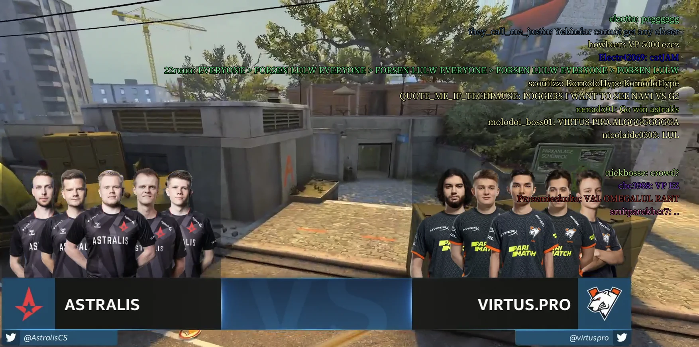

# [mpv Twitch Chat](https://github.com/CrendKing/mpv-twitch-chat)

Show Twitch chat messages as subtitles when watching Twitch VOD with mpv.

mpv internally uses youtube-dl to handle Twitch VOD URL. In addition to the regular video track, it also adds a "rechat" subtitle track. This track points to the Twitch API `videos/<video_id>/comments`, which contains the full transcript of a VOD's chat messages in JSON. Unfortunately, mpv can't directly consume the JSON as subtitle. This script converts it into a SubRip subtitle track so that mpv can directly display the chat messages.

Note that since subtitle is text-based only, all Twitch emotes are shown as text.

The API this script uses to get the chat data is undocumented and not intended for public use, [according to Twitch](https://discuss.dev.twitch.tv/t/getting-chat-messages-on-new-api/26176). It could change or be broken at any moment, and there is no guarantee from the author. Use at your own risk.

## Features

* Configurable to show commenter's name.
* Configurable to show colored messages.
* Configurable message duration.
* Friendly to mpv's built-in subtitle options.

## Requirement

* [curl](https://curl.se/), which should be preinstalled in most operating systems

## Install

Best way to install is `git clone` this repo in mpv's "scripts" directory. This approach allows easy update by simply `git pull`.

Alternatively, one can [download the repo as zip](https://github.com/CrendKing/mpv-twitch-chat/archive/refs/heads/master.zip) and extract to mpv's "scripts" directory. Updates must be made manually.

Script option file should be placed in mpv's `script-opts` directory as usual. Options are explains in the script file.

User should specify a working Twitch API client ID in the option file.

## Usage

To activate the script, play a Twitch VOD and switch on the "rechat" subtitle track. The script will replace it with its own subtitle track.

You can use mpv's auto profiles to conditionally apply special subtitle options when Twitch VOD is on. For example,
```
[twitch]
profile-cond=get("path", ""):find("^https://www.twitch.tv/") ~= nil
profile-restore=copy-equal
sub-font-size=30
sub-align-x=right
sub-align-y=top
```
makes the Twitch chat subtitles smaller than default, and moved to the top right corner.

## Screenshot


