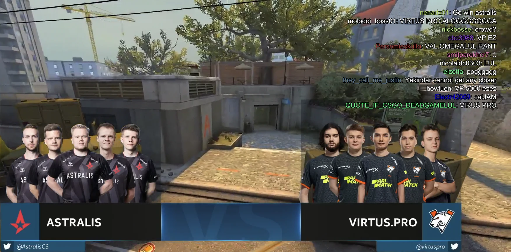

# [mpv Twitch Chat](https://github.com/CrendKing/mpv-twitch-chat)

Show Twitch chat messages as subtitles when watching Twitch VOD with mpv.

mpv internally uses youtube-dl to handle Twitch VOD URL. In addition to the regular video track, it also adds a "rechat" subtitle track. This track points to the Twitch API `videos/<video_id>/comments`, which contains the full transcript of a VOD's chat messages in JSON. Unfortunately, mpv can't directly consume the JSON as subtitle. This script converts it into a SubRip subtitle track so that mpv can directly display the chat messages.

Note that since subtitle is text-based only, all Twitch emotes are shown as text.

## Features

* Configurable to show commenter's name.
* Configurable to show colored messages.
* Configurable message duration.
* Friendly to mpv's built-in subtitle options.

## Requirement

* [json.lua](https://github.com/rxi/json.lua)
* [curl](https://curl.se/)

## Install

The easiest way to install is `git clone` this repo in mpv's `scripts` directory, then `git submodule update --init --recursive` inside the repo directory.

Otherwise, download the repo as zip and fill the "json.lua" directory with [json.lua](https://github.com/rxi/json.lua). Then put the whole directory to mpv's `scripts` directory.

Script option file should be placed in mpv's `script-opts` directory as usual. Please read the comments in the script for how to use the options.

## Usage

To activate the script, play a Twitch VOD and switch on the "rechat" subtitle track. The script will replace it with its own subtitle track.

You can use mpv's auto profiles to conditionally apply special subtitle options when Twitch VOD is on. For example,
```
[twitch]
profile-cond=get("path", ""):find("^https://www.twitch.tv/") ~= nil
profile-restore=copy-equal
sub-font-size=30
sub-align-x=right
sub-align-y=top
```
makes the Twitch chat subtitles smaller than default, and moved to the top right corner.

## Screenshot


